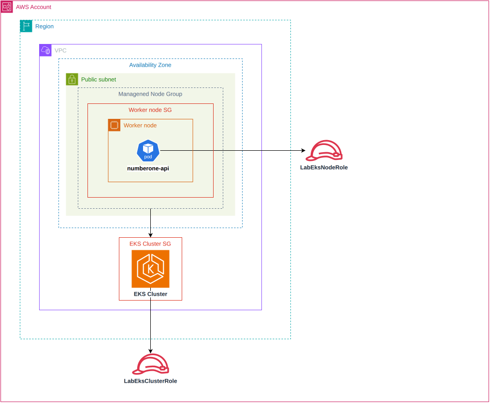

# Módulo EKS

Provisiona o cluster Amazon EKS e seu managed node group para executar as
workloads do NumberOne.

## Arquitetura

## Recursos

- cluster Amazon EKS;
- managed node group sob demanda;
- configuração de escalabilidade do node group;
- acesso à API do cluster por endpoints público e privado;
- autenticação EKS no modo `API_AND_CONFIG_MAP`.

## Decisões relevantes

- O cluster e os nodes usam as subnets públicas fornecidas pelo módulo VPC.
- As roles IAM são recebidas como ARNs de roles existentes no AWS Academy.
- Os CIDRs autorizados no endpoint público são configuráveis por
  `endpoint_public_access_cidrs`.
- O security group criado pelo EKS é exposto como output; a regra para os
  NodePorts internos da API é criada no state raiz, não neste módulo.

## Interface

Entradas: nome e versão do cluster, ARNs das roles, IDs das subnets, CIDRs do
endpoint público, tipos de instância e limites de escala do node group.

Saídas: nome, endpoint, dados da autoridade certificadora e ID do security
group do cluster.
