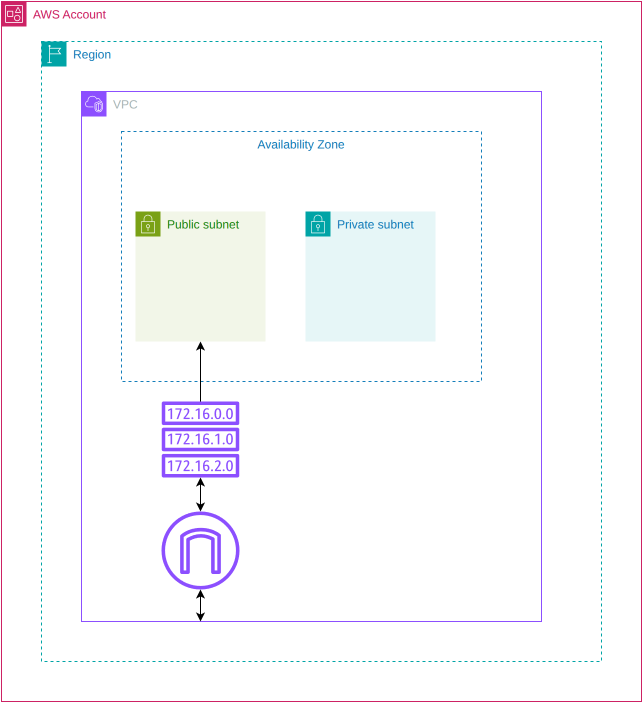

# Módulo VPC

Provisiona a rede base da infraestrutura cloud do NumberOne.

## Arquitetura

## Recursos

- VPC com suporte a DNS e hostnames;
- Internet Gateway;
- uma subnet pública e uma privada por zona de disponibilidade configurada;
- route table pública com rota padrão para o Internet Gateway;
- route table privada, sem rota padrão de saída;
- associações das route tables às respectivas subnets.

## Decisões relevantes

- O módulo exige a mesma quantidade de CIDRs públicos, CIDRs privados e zonas
  de disponibilidade. A configuração principal utiliza duas AZs.
- As subnets públicas recebem IP público no lançamento e são usadas pelo EKS.
- As tags das subnets indicam descoberta por load balancers públicos e internos
  do Kubernetes. A reserva de subnets privadas atende integrações internas,
  incluindo o state de banco de dados mantido em outro repositório.
- Não há NAT Gateway neste módulo; por isso a route table privada não possui
  rota padrão para a internet.

## Interface

Entradas: `name_prefix`, `vpc_cidr`, `availability_zones`,
`public_subnet_cidrs` e `private_subnet_cidrs`.

Saídas: `vpc_id`, `public_subnet_ids` e `private_subnet_ids`.
